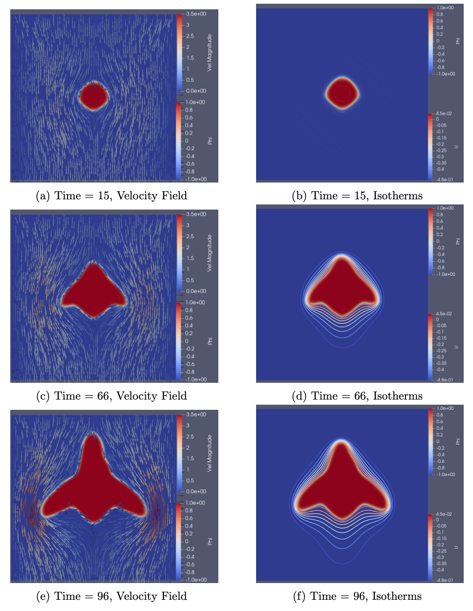

# Coupled Phase-Field and Fluid Flow Modeling in Additive Manufacturing

## Overview

This repository contains the research and development work related to understanding the microstructural evolution in additive manufacturing (AM). The focus is on coupling fluid flow with solidification modeling to enhance the properties and performance of additively manufactured materials.

## Thesis Abstract

This research focuses on understanding additive manufacturing (AM) microstructure to enhance properties. Focusing on microstructure evolution during solidification, we aim to provide deeper insights into material formation by exploring the often-neglected or partially integrated aspect of fluid flow within the melt pool. This fluid flow is crucial as it influences concentration and temperature distribution, impacting microstructure development and therefore material behavior.

To bridge this gap, our project is developing a phase-field modeling microstructural model for solidification, coupled with the Navier-Stokes equation for fluid dynamics. Using the Finite Element Method (FEM) based library, FEniCS, we present our current development of the multiphysics approach needed. In this repository, we describe the model contributions of each physics contribution and our benchmark results against known literature. We discuss the need for the direct coupling of these into a singular, fully coupled solver, enhancing our understanding and control of AM processes.

📘 **Full Text Available on ResearchGate:**  
[🔗 View Thesis PDF](https://www.researchgate.net/publication/378782785_DEVELOPING_A_COUPLED_MICROSTRUCTURE_FLUID_FLOW_MODEL_FOR_SOLIDIFICATION_IN_ADDITIVE_MANUFACTURING)

## Project Overview

